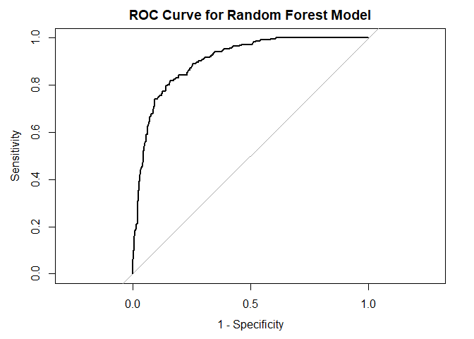

<br>

**About Data Analysis Report**

This file contains the report of the data analysis done for
the project on building and deploying a stroke prediction model in R. It
contains analysis such as data exploration, summary statistics and
building the prediction models. The final report was completed on
Sun Jul 28 23:27:24 2024.
<br>
<br>

**Data Description:**

According to the World Health Organization (WHO) stroke is the 2nd
leading cause of death globally, responsible for approximately 11% of
total deaths.

This data set is used to predict whether a patient is likely to get
stroke based on the (demographic input parameters such as gender, age,
residence, etc.) and health-related parameters (i.e. hypertension,
smoking status, glucose levels, etc.) Each row in the data provides
relevant information about the patient.
<br>
<br>

# Setup and Data Cleaning


## Loading libraries
<br>

``` r
library(dplyr)
library(remotes)
library(fastDummies)
library(caret)
library(VIM)
library(ggplot2)
library(ROSE) 
library(lattice)
library(randomForest)
library(pROC)
```


## Loading Data
<br>


``` r
strokedata<-read.csv("./strokedata.csv")
```


## Data Description and Exploration

<br>

``` r
names(strokedata)
```

```
##  [1] "id"                "gender"            "age"              
##  [4] "hypertension"      "heart_disease"     "ever_married"     
##  [7] "work_type"         "Residence_type"    "avg_glucose_level"
## [10] "bmi"               "smoking_status"    "stroke"
```

``` r
head(strokedata)
```

```
##      id gender age hypertension heart_disease ever_married     work_type
## 1  9046   Male  67            0             1          Yes       Private
## 2 51676 Female  61            0             0          Yes Self-employed
## 3 31112   Male  80            0             1          Yes       Private
## 4 60182 Female  49            0             0          Yes       Private
## 5  1665 Female  79            1             0          Yes Self-employed
## 6 56669   Male  81            0             0          Yes       Private
##   Residence_type avg_glucose_level  bmi  smoking_status stroke
## 1          Urban            228.69 36.6 formerly smoked      1
## 2          Rural            202.21  N/A    never smoked      1
## 3          Rural            105.92 32.5    never smoked      1
## 4          Urban            171.23 34.4          smokes      1
## 5          Rural            174.12   24    never smoked      1
## 6          Urban            186.21   29 formerly smoked      1
```

``` r
summary(strokedata) 
```

```
##        id           gender               age         hypertension    
##  Min.   :   67   Length:5110        Min.   : 0.08   Min.   :0.00000  
##  1st Qu.:17741   Class :character   1st Qu.:25.00   1st Qu.:0.00000  
##  Median :36932   Mode  :character   Median :45.00   Median :0.00000  
##  Mean   :36518                      Mean   :43.23   Mean   :0.09746  
##  3rd Qu.:54682                      3rd Qu.:61.00   3rd Qu.:0.00000  
##  Max.   :72940                      Max.   :82.00   Max.   :1.00000  
##  heart_disease     ever_married        work_type         Residence_type    
##  Min.   :0.00000   Length:5110        Length:5110        Length:5110       
##  1st Qu.:0.00000   Class :character   Class :character   Class :character  
##  Median :0.00000   Mode  :character   Mode  :character   Mode  :character  
##  Mean   :0.05401                                                           
##  3rd Qu.:0.00000                                                           
##  Max.   :1.00000                                                           
##  avg_glucose_level     bmi            smoking_status         stroke       
##  Min.   : 55.12    Length:5110        Length:5110        Min.   :0.00000  
##  1st Qu.: 77.25    Class :character   Class :character   1st Qu.:0.00000  
##  Median : 91.89    Mode  :character   Mode  :character   Median :0.00000  
##  Mean   :106.15                                          Mean   :0.04873  
##  3rd Qu.:114.09                                          3rd Qu.:0.00000  
##  Max.   :271.74                                          Max.   :1.00000
```

<br>

There are 5110 observations and 12 variables in the dataset. Some
variables need to converted to the appropriate data type. Smoking
variable also has unknowns which could be changed into NAs for R to
detect. There is also some missingness in the BMI and smoking status variables.


## Data Type Conversion
<br>


``` r
#Converting characters to factors
strokedata$gender <- factor(strokedata$gender)
strokedata$ever_married <- factor(strokedata$ever_married)
strokedata$work_type <- factor(strokedata$work_type)
strokedata$Residence_type <- factor(strokedata$Residence_type)
strokedata$smoking_status <- factor(strokedata$smoking_status)
strokedata$stroke <- factor(strokedata$stroke)

#Converting BMI to a numeric data type
#This code automatically codes any N/A in BMI into NA
strokedata$bmi <- as.numeric(strokedata$bmi)
```

```
## Warning: NAs introduced by coercion
```

``` r
#converting smoking_status unknown category to NA and removing the unknown 
#category as it is no longer needed
strokedata$smoking_status[strokedata$smoking_status == "Unknown"] <- NA
strokedata$smoking_status <- droplevels(strokedata$smoking_status) 

#ID is not needed
#dropping id
strokedata <- strokedata %>%
  select(-id)
```

<br>

## Examining Missingness
Note from earlier that there was some missingness in the data. Let's
delve into this.

<br>


``` r
aggr_plot <- aggr(strokedata, col=c('navyblue','red'), numbers=TRUE, sortVars=TRUE, labels=names(data), cex.axis=.7, gap=3, ylab=c("Histogram of missing data","Pattern"))
```

<!-- -->

```
## 
##  Variables sorted by number of missings: 
##           Variable      Count
##     smoking_status 0.30215264
##                bmi 0.03933464
##             gender 0.00000000
##                age 0.00000000
##       hypertension 0.00000000
##      heart_disease 0.00000000
##       ever_married 0.00000000
##          work_type 0.00000000
##     Residence_type 0.00000000
##  avg_glucose_level 0.00000000
##             stroke 0.00000000
```
<br>

~30% of data in smoking status is missing. Should drop the entire
variable so as not to lose data on other variables. Single imputations could also
bring their own biases but for future reference, consider multiple imputations


<br>

``` r
#Visually checking the missingness pattern in BMI

na.gender <- strokedata %>%
  group_by(gender) %>%
  summarise(na_count = sum(is.na(bmi)), total_count = n(), na_percentage = na_count / total_count * 100, .groups = 'drop')

# Create the bar plot
ggplot(na.gender, aes(x = gender, y = na_percentage, fill = gender)) +
  geom_bar(stat = "identity") +
  labs(
    title = "Percentage of BMI Missingness by Gender",
    x = "Gender",
    y = "Percentage of Missing BMI Values (%)"
  ) +
  theme_minimal() +
  scale_fill_manual(values = c("lightblue", "darkblue", "orange")) +  # Customize colors
  geom_text(aes(label = sprintf("%.2f%%", na_percentage)), vjust = -0.5) +
  theme(legend.position = "none")  # Hide legend if only two genders

na.hypertension <- strokedata %>%
  group_by(hypertension) %>%
  summarise(na_count = sum(is.na(bmi)), total_count = n(), na_percentage = na_count / total_count * 100, .groups = 'drop')

# Create the bar plot
ggplot(na.hypertension, aes(x = as.factor(hypertension), y = na_percentage, fill = hypertension)) +
  geom_bar(stat = "identity") +
  labs(
    title = "Percentage of BMI Missingness by Hypertension",
    x = "Gender",
    y = "Percentage of Missing BMI Values (%)"
  ) +
  theme_minimal() +
  scale_fill_gradient(low = "lightblue", high = "darkblue") +
  geom_text(aes(label = sprintf("%.2f%%", na_percentage)), vjust = -0.5)

na.heart_disease <- strokedata %>%
  group_by(heart_disease) %>%
  summarise(na_count = sum(is.na(bmi)), total_count = n(), na_percentage = na_count / total_count * 100, .groups = 'drop')

# Create the bar plot
ggplot(na.heart_disease, aes(x = as.factor(heart_disease), y = na_percentage, fill = heart_disease)) +
  geom_bar(stat = "identity") +
  labs(
    title = "Percentage of BMI Missingness by Heart Disease",
    x = "Gender",
    y = "Percentage of Missing BMI Values (%)"
  ) +
  theme_minimal() +
  scale_fill_gradient(low = "lightblue", high = "darkblue") +
  geom_text(aes(label = sprintf("%.2f%%", na_percentage)), vjust = -0.5)

na.stroke <- strokedata %>%
  group_by(stroke) %>%
  summarise(na_count = sum(is.na(bmi)), total_count = n(), na_percentage = na_count / total_count * 100, .groups = 'drop')

# Create the bar plot
ggplot(na.stroke, aes(x = stroke, y = na_percentage, fill = stroke)) +
  geom_bar(stat = "identity") +
  labs(
    title = "Percentage of BMI Missingness by Stroke",
    x = "Gender",
    y = "Percentage of Missing BMI Values (%)"
  ) +
  theme_minimal() +
  scale_fill_manual(values = c("lightblue", "darkblue")) +  # Customize colors
  geom_text(aes(label = sprintf("%.2f%%", na_percentage)), vjust = -0.5) +
  theme(legend.position = "none")  # Hide legend if only two genders

#do not need to generate more
```

<!-- -->

<!-- -->
<br>

Visually, it appears that the BMI is not Missing Completely at Random (MCAR). 
Rather, it seems that BMI missingness is associated with other variables, 
such as heart disease, stroke, etc -> Missingness at Random (MAR).

## Handling Missing Values

Will conduct mean imputations for missingness in the BMI variable and drop the
smoking status variable as explained above

<br>

``` r
#Removing the smoking status variable
strokedata <- select(strokedata, -smoking_status)

# Calculate the mean of 'var', ignoring NA values
mean_value <- mean(strokedata$bmi, na.rm = TRUE)

# Replace NA values with the mean
strokedata$bmi[is.na(strokedata$bmi)] <- mean_value

#Check if there is still missingness
any(is.na(strokedata))
```

```
## [1] FALSE
```

<br>

The 'False' output indicates that there is no missingness in the data now.


## Transforming all data to numeric variables

<br>
Many machine learning (ML) models require data to be numeric. In the
next two steps, any data that is not numeric is converted.

<br>

``` r
#converting appropriate variables to numeric for later
strokedata$gender <- as.numeric(strokedata$gender) 
strokedata$hypertension <- as.numeric(strokedata$hypertension)
strokedata$heart_disease <- as.numeric(strokedata$heart_disease)
strokedata$ever_married <- as.numeric(strokedata$ever_married)
```

<br>

Notice that Residence_type and work_type were not converted numerically.
This is because these variables do not have an inherent order (i.e. they
are not ordinal variables). To avoid ML models from interpreting
information from these variables as ordinal data, one-hot encoding needs
to take place to convert each categorical value to its own variable.


## One-hot Encoding

<br>


``` r
# 1. One-hot encoding -work_type
work_type_dummy <- dummyVars(" ~ work_type", data = strokedata, sep = "_")
work_type_encoded <- predict(work_type_dummy, strokedata)
# Add the encoded columns to original dataset
strokedata <- cbind(strokedata, work_type_encoded)

# 2. One-hot encoding -residence_type
residence_type_dummy <- dummyVars(" ~ Residence_type", data = strokedata, sep = "_")
residence_type_encoded <- predict(residence_type_dummy, strokedata)
# Add the encoded columns to original dataset
strokedata <- cbind(strokedata, residence_type_encoded)

#Removing the parent work_type and Residence_type variables
strokedata <- strokedata%>%
  select(-work_type)
strokedata <- strokedata%>%
  select(-Residence_type)
strokedata <- strokedata %>% 
  rename(work_type_Self = `work_type_Self-employed`)
```

<br>

Now all data is numerically converted which should be easier for some ML
models to work with.
<br>

# Data Preparation for Modeling


## Checking Class balance

<br>
In this next step, the distribution of the target variable, what the
models will be predicting (i.e. stroke), will be determined. If there is
a great deal of imbalance, the ML models will be biased towards
predicting the majority class.
<br>

``` r
summary(strokedata$stroke)
```

```
##    0    1 
## 4861  249
```

``` r
percentage_data <- strokedata %>%
  group_by(stroke) %>%
  summarise(percentage = n() / nrow(strokedata) * 100)

ggplot(percentage_data, aes(x = stroke, y = percentage, fill = stroke)) +
  geom_bar(stat = "identity") +
  labs(title = "Distribution of Stroke Cases",
       x = "Stroke",
       y = "Percentage (%)") +
  theme_minimal()
```

<!-- -->

<br>

As displayed above, there is a substantial amount of imabalance. About
95% of the participants did not have a stroke. The uneven distribution
needs to be handled before ML models are run.


## Balancing Class

<br>
In this next step, the majority class will be under-sampled and the
minority class will be over-sampled to achieve an equal distribution in
the variable. An advantage of this decision could be that the sample
size remains the same, rather than increasing if only oversampling was
utilized, which could potentially cause over-fitting. However, a
disadvantage of this technique is that information from the majority
class is lost.
<br>


``` r
stroke1 <- ovun.sample(stroke~., data=strokedata,
                                 N=nrow(strokedata), p=0.5,
                                 seed=1, method="both")$data

#Visualizing if stroke is balanced
barplot(table(stroke1$stroke))
```

<!-- -->
<br>

As seen from the graph above, the stroke variable is now balanced.


## Splitting data 

<br>

``` r
# create a list of 80% of the rows in the dataset we can use for training
test_index <- createDataPartition(stroke1$stroke, p=0.80, list=FALSE)
# select 20% of the data for testing
test1 <- stroke1[-test_index,]
# use the remaining 80% of data to training and validating the models
dataset1 <- stroke1[test_index,]
```

<br>

In the analysis, multiple ML models will be generated and compared
against each other. Some ML models prefer data to be normalized, and so to
ensure comparability across all models, the same dataset will be
normalized and used for each ML algorithm.


## Data Normalization

<br>
In this step, min-max normalization is utilized (a common method in ML
models). This technique scales data to a specific range, [0,1] in this
case. As a lot of the variables in the dataset have a predefined range,
this method is quite useful.
<br>

``` r
preprocessed_data1 <- preProcess(dataset1, method = 'range')
transformed_data1 <- predict(preprocessed_data1, dataset1)

preprocessed_data1.1 <- preProcess(test1, method = 'range')
tvalidated_data1 <- predict(preprocessed_data1.1, test1)
```
<br>


Note that the data normalization step was done now at this point, after splitting data
into training and testing sets. This was done to avoid data leakage from the testing
set to the training set, which could potentially result in
over-optimistic results had normalization occurred before splitting the data.

# Building Prediction Models 
<br>
To estimate the performance metrics, 10-fold cross-validation technique
will be used which will also reduce over-fitting and result in a more robust
evaluation than a train-validate-test split. This technique also both
trains and validates. This process is repeated three times (i.e.
repeated k-cross validation) with different splits of the data to get a
more accurate estimate.


In addition, the models are going to be evaluated by using the
"Accuracy" metric. Accuracy is calculated as the ratio of correctly
predicted instances to the total number of instances in the dataset,
multiplied by 100 to express it as a percentage (e.g., 95% accuracy).
This metric will be used to assess and compare the performance of each
model.
<br>

``` r
# Running algorithms using repeated 10-fold cross validation
control <- trainControl(method="repeatedcv", number=10, repeats=3)
metric <- "Accuracy"

# a) Generalized Linear Model
set.seed(7)
fit.glmnet <- train(stroke~., data=transformed_data1, method="glmnet", metric=metric, trControl=control)
# CART
fit.cart <- train(stroke~., data=transformed_data1, method="rpart", metric=metric, trControl=control)
# b) nonlinear algorithms
# kNN
set.seed(7)
fit.knn <- train(stroke~., data=transformed_data1, method="knn", metric=metric, trControl=control)
# c) advanced algorithms
# SVM
set.seed(7)
fit.svm <- train(stroke~., data=transformed_data1, method="svmRadial", metric=metric, trControl=control)
# Random Forest
set.seed(7)
library(randomForest)
fit.rf <- train(stroke~., data=transformed_data1, method="rf", metric=metric, trControl=control)
```

<br>


# Model Selection

<br>

``` r
results <- resamples(list(glmnet=fit.glmnet, cart=fit.cart, knn=fit.knn, svm=fit.svm, rf=fit.rf))
summary(results)
```

```
## 
## Call:
## summary.resamples(object = results)
## 
## Models: glmnet, cart, knn, svm, rf 
## Number of resamples: 30 
## 
## Accuracy 
##             Min.   1st Qu.    Median      Mean   3rd Qu.      Max. NA's
## glmnet 0.7408313 0.7701711 0.7848411 0.7814437 0.7921760 0.8288509    0
## cart   0.7823961 0.8001222 0.8117359 0.8105514 0.8214065 0.8480392    0
## knn    0.8141809 0.8386308 0.8410758 0.8451961 0.8575795 0.8704156    0
## svm    0.7579462 0.7946210 0.8092910 0.8098133 0.8282396 0.8459658    0
## rf     0.9388753 0.9639155 0.9706601 0.9692683 0.9749389 0.9877751    0
## 
## Kappa 
##             Min.   1st Qu.    Median      Mean   3rd Qu.      Max. NA's
## glmnet 0.4811508 0.5410665 0.5706191 0.5635119 0.5856054 0.6572735    0
## cart   0.5649924 0.6003285 0.6240404 0.6216316 0.6432545 0.6961149    0
## knn    0.6311993 0.6796421 0.6845783 0.6925295 0.7168631 0.7422381    0
## svm    0.5156057 0.5895388 0.6197068 0.6204679 0.6568304 0.6920733    0
## rf     0.8780633 0.9279181 0.9413704 0.9386037 0.9499092 0.9755485    0
```

``` r
dotplot(results)
```

<!-- -->

<br>

As seen from the visualizations above, the Random Forest technique has the greatest performance over the other ML algorithms. This algorithm will now be selected to make predictions (testing the algorithm on the test dataset generated earlier).


# Random Forest Algorithm Assessment 


## Performance
<br>

Running the RF algorithm on the test dataset to make predictions and determine its performance.
<br>


``` r
predictions <- predict(fit.rf, tvalidated_data1)
confusionMatrix(predictions, tvalidated_data1$stroke)
```

```
## Confusion Matrix and Statistics
## 
##           Reference
## Prediction   0   1
##          0 509 308
##          1  15 189
##                                           
##                Accuracy : 0.6836          
##                  95% CI : (0.6541, 0.7121)
##     No Information Rate : 0.5132          
##     P-Value [Acc > NIR] : < 2.2e-16       
##                                           
##                   Kappa : 0.3571          
##                                           
##  Mcnemar's Test P-Value : < 2.2e-16       
##                                           
##             Sensitivity : 0.9714          
##             Specificity : 0.3803          
##          Pos Pred Value : 0.6230          
##          Neg Pred Value : 0.9265          
##              Prevalence : 0.5132          
##          Detection Rate : 0.4985          
##    Detection Prevalence : 0.8002          
##       Balanced Accuracy : 0.6758          
##                                           
##        'Positive' Class : 0               
## 
```

``` r
#Plotting an ROC Curve
predictions <- predict(fit.rf, tvalidated_data1, type="prob")
predicted_probabilities <- predictions[, "1"]
library(pROC)
roc_curve <- roc(tvalidated_data1$stroke, predicted_probabilities)
```

```
## Setting levels: control = 0, case = 1
```

```
## Setting direction: controls < cases
```

``` r
plot(roc_curve, main="ROC Curve for Random Forest Model", legacy.axes=TRUE)
```

<!-- -->
<br>


As displayed, the model has a accuracy of 68.36%. The algorithm has a
high sensitivity (0.9714), making it quite effective at correctly
predicting True Positives (i.e. those who will have a stroke). However, on the 
other hand, the model exhibits low specificity (0.3803), indicating that it is very 
poor at correctly predicting those who will not have a stroke.


## Feature Detection

<br>
This next step will determine which features were the most important in
allowing the RF algorithm to make its predictions.
<br>

``` r
feature_importance <- varImp(fit.rf, scale = FALSE)$importance

impFeatures_raw <- data.frame(
  Feature = rownames(feature_importance),
  Importance = feature_importance[, "Overall"]  # Adjust column name based on the output
)

# Normalize the importance scores
impFeatures_raw <- impFeatures_raw %>%
  mutate(
    Normalized_Importance = Importance / sum(Importance)  # Normalize to sum to 1
  ) %>%
  arrange(desc(Normalized_Importance))

# Print the normalized feature importance
print(impFeatures_raw)
```

```
##                   Feature   Importance Normalized_Importance
## 1                     age 9.115457e+02          4.471489e-01
## 2       avg_glucose_level 4.326800e+02          2.122465e-01
## 3                     bmi 3.876651e+02          1.901649e-01
## 4            ever_married 5.265677e+01          2.583021e-02
## 5            hypertension 4.860291e+01          2.384163e-02
## 6                  gender 4.413671e+01          2.165079e-02
## 7          work_type_Self 3.238610e+01          1.588665e-02
## 8           heart_disease 2.816320e+01          1.381515e-02
## 9       work_type_Private 2.683348e+01          1.316287e-02
## 10   Residence_type_Urban 2.379879e+01          1.167424e-02
## 11   Residence_type_Rural 2.373099e+01          1.164098e-02
## 12     work_type_Govt_job 2.050358e+01          1.005781e-02
## 13     work_type_children 5.867166e+00          2.878075e-03
## 14 work_type_Never_worked 2.757835e-03          1.352826e-06
```

``` r
#visualizing

# Create the bar plot
ggplot(impFeatures_raw, aes(x = reorder(Feature, Normalized_Importance), y = Normalized_Importance)) +
  geom_bar(stat = "identity", fill = "steelblue") +
  coord_flip() +  # Flip coordinates for better readability
  labs(
    x = "Feature",
    y = "Normalized Importance"
  ) +
  theme_minimal() +
  theme(
    axis.text.x = element_text(size = 12),
    axis.text.y = element_text(size = 12),
    axis.title.x = element_text(size = 14),
    axis.title.y = element_text(size = 14),
    plot.title = element_text(size = 16, face = "bold")
  )
```

<!-- -->

<br>

In order of importance, age, average glucose levels, and BMI were the most 
influential features in the Random Forest model to predict stroke in subjects. 
Taken together, these features play a significant role in the model's 
decision-making process. 

# R Environment and Session Information

<br>

``` r
sessionInfo()
```

```
## R version 4.3.1 (2023-06-16 ucrt)
## Platform: x86_64-w64-mingw32/x64 (64-bit)
## Running under: Windows 10 x64 (build 19045)
## 
## Matrix products: default
## 
## 
## locale:
## [1] LC_COLLATE=English_Canada.utf8  LC_CTYPE=English_Canada.utf8   
## [3] LC_MONETARY=English_Canada.utf8 LC_NUMERIC=C                   
## [5] LC_TIME=English_Canada.utf8    
## 
## time zone: America/Edmonton
## tzcode source: internal
## 
## attached base packages:
## [1] grid      stats     graphics  grDevices utils     datasets  methods  
## [8] base     
## 
## other attached packages:
##  [1] gridExtra_2.3        png_0.1-8            jpeg_0.1-10         
##  [4] pROC_1.18.5          randomForest_4.7-1.1 ROSE_0.0-4          
##  [7] VIM_6.2.2            colorspace_2.1-0     caret_6.0-94        
## [10] lattice_0.21-8       ggplot2_3.5.1        fastDummies_1.7.3   
## [13] remotes_2.5.0        dplyr_1.1.3         
## 
## loaded via a namespace (and not attached):
##  [1] tidyselect_1.2.0     timeDate_4032.109    farver_2.1.1        
##  [4] fastmap_1.1.1        digest_0.6.33        rpart_4.1.19        
##  [7] timechange_0.2.0     lifecycle_1.0.3      survival_3.5-5      
## [10] kernlab_0.9-32       magrittr_2.0.3       compiler_4.3.1      
## [13] rlang_1.1.1          sass_0.4.7           tools_4.3.1         
## [16] utf8_1.2.3           yaml_2.3.7           data.table_1.14.8   
## [19] knitr_1.48           labeling_0.4.3       sp_2.1-4            
## [22] plyr_1.8.9           abind_1.4-5          withr_2.5.1         
## [25] purrr_1.0.2          nnet_7.3-19          stats4_4.3.1        
## [28] fansi_1.0.4          e1071_1.7-13         future_1.33.2       
## [31] globals_0.16.3       scales_1.3.0         iterators_1.0.14    
## [34] MASS_7.3-60          cli_3.6.1            rmarkdown_2.27      
## [37] generics_0.1.3       rstudioapi_0.15.0    future.apply_1.11.2 
## [40] robustbase_0.99-3    reshape2_1.4.4       cachem_1.0.8        
## [43] proxy_0.4-27         stringr_1.5.0        splines_4.3.1       
## [46] parallel_4.3.1       vctrs_0.6.3          glmnet_4.1-8        
## [49] hardhat_1.4.0        boot_1.3-28.1        Matrix_1.6-1.1      
## [52] jsonlite_1.8.8       carData_3.0-5        car_3.1-2           
## [55] listenv_0.9.1        vcd_1.4-12           foreach_1.5.2       
## [58] gower_1.0.1          jquerylib_0.1.4      recipes_1.1.0       
## [61] glue_1.6.2           parallelly_1.37.1    DEoptimR_1.1-3      
## [64] codetools_0.2-19     shape_1.4.6.1        lubridate_1.9.2     
## [67] stringi_1.7.12       gtable_0.3.4         lmtest_0.9-40       
## [70] munsell_0.5.0        tibble_3.2.1         pillar_1.9.0        
## [73] htmltools_0.5.6      ipred_0.9-15         lava_1.8.0          
## [76] R6_2.5.1             evaluate_0.21        highr_0.11          
## [79] bslib_0.5.1          class_7.3-22         Rcpp_1.0.12         
## [82] nlme_3.1-162         prodlim_2024.06.25   ranger_0.16.0       
## [85] laeken_0.5.3         xfun_0.46            zoo_1.8-12          
## [88] pkgconfig_2.0.3      ModelMetrics_1.2.2.2
```

